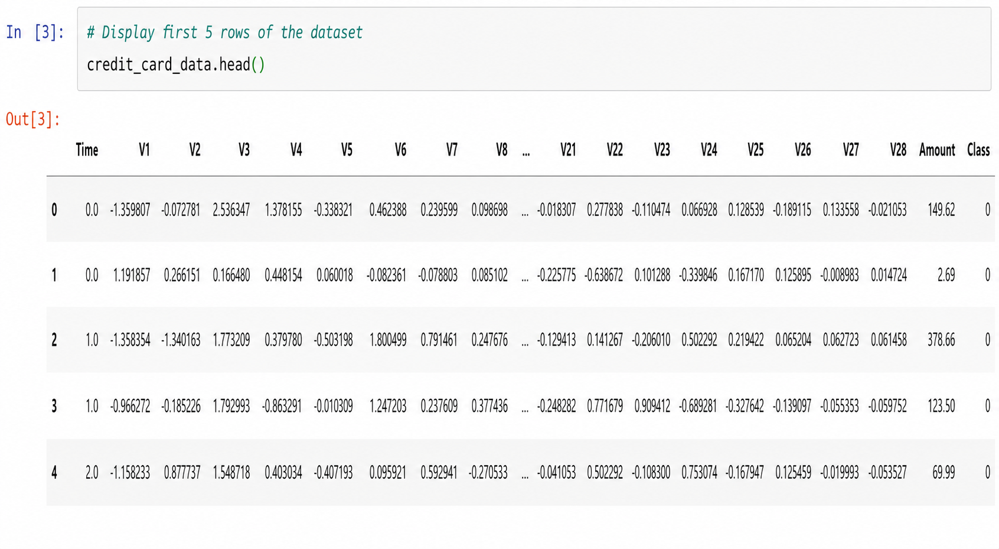
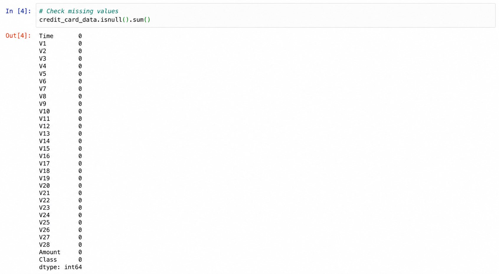
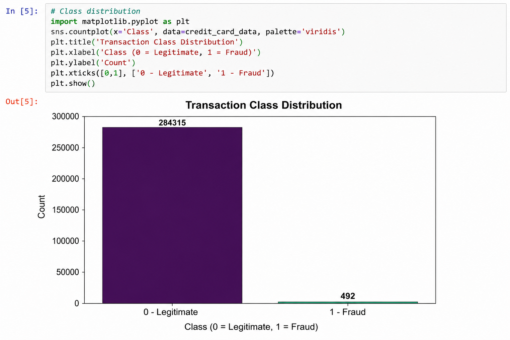
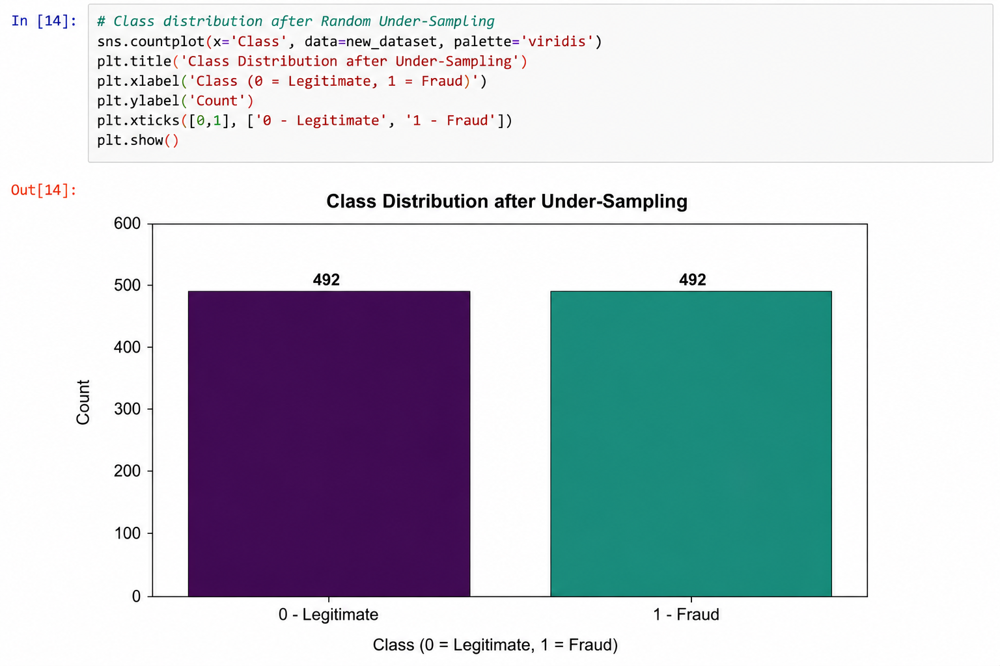
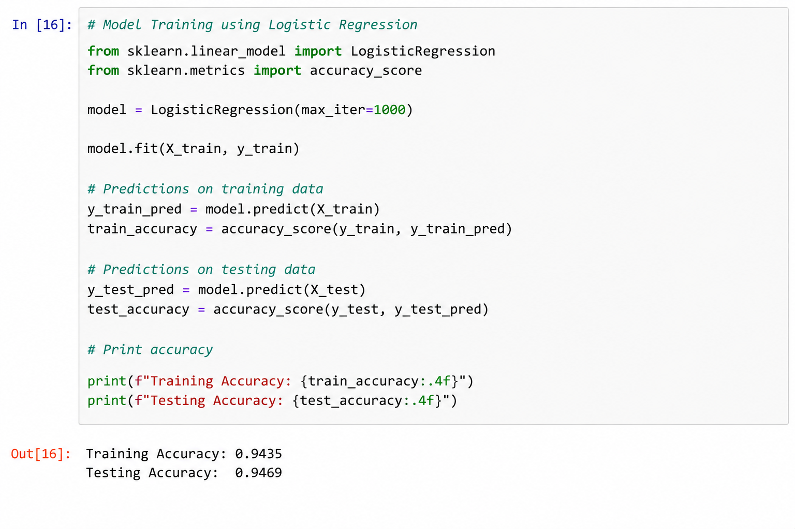
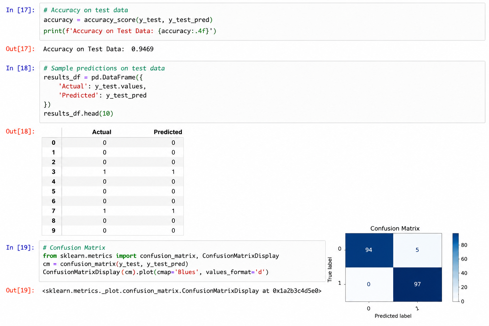

# 💳 Credit Card Fraud Detection

A Machine Learning project that detects fraudulent credit card transactions using **Logistic Regression**. The project addresses the highly imbalanced dataset through **Random Under-Sampling** and evaluates the model using classification accuracy.

---

## 📌 Features

- Data Preprocessing
- Missing Value Analysis
- Exploratory Data Analysis (EDA)
- Class Imbalance Handling
- Random Under-Sampling
- Logistic Regression
- Fraud Detection
- Model Evaluation

---

## 🛠 Tech Stack

- Python
- Pandas
- NumPy
- Matplotlib
- Seaborn
- Scikit-learn

---

## 📂 Dataset

The dataset contains anonymized credit card transactions with:

- Time
- Amount
- V1–V28 (PCA-transformed features)
- Class (0 = Legitimate, 1 = Fraud)

---

## ⚙️ Workflow

1. Load Dataset
2. Analyze Missing Values
3. Explore Class Distribution
4. Perform Random Under-Sampling
5. Split Training & Testing Data
6. Train Logistic Regression Model
7. Evaluate Model Performance

---

## 📈 Model

**Algorithm:** Logistic Regression

**Evaluation Metric:** Accuracy Score

---

## 📸 Screenshots

### Dataset Preview

### Missing Values Analysis

### Transaction Class Distribution

### Under-Sampling

### Model Training

### Prediction Output

---

## 🚀 Future Improvements

- SMOTE for balancing
- Random Forest & XGBoost comparison
- Precision-Recall Optimization
- ROC Curve Analysis
- Streamlit Deployment

---

## 👨‍💻 Author

**Abhishek Prajapati**
